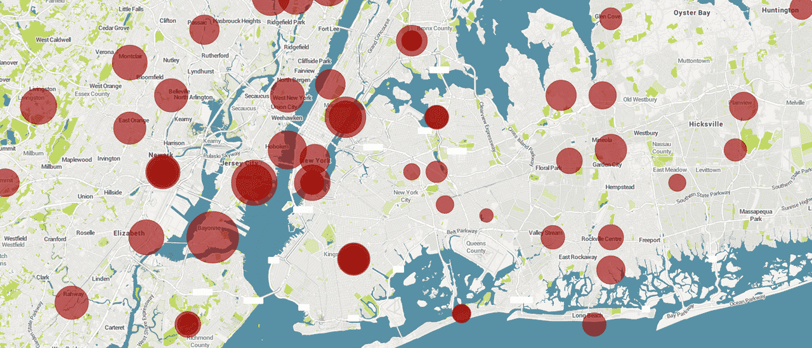
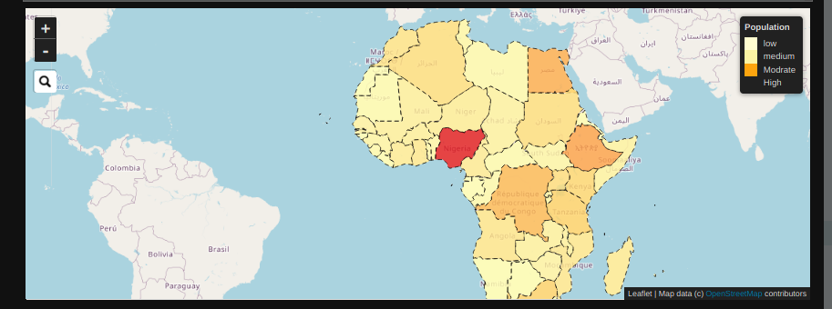
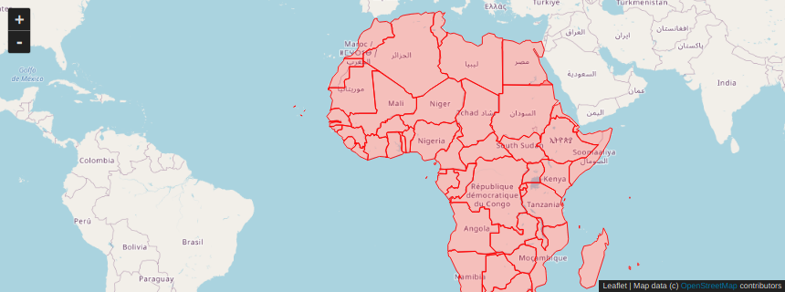
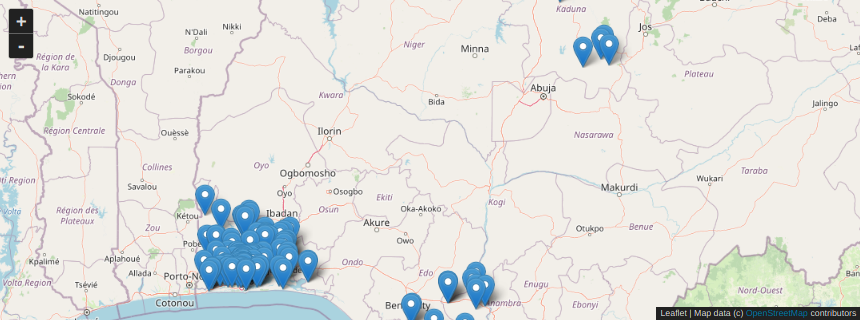
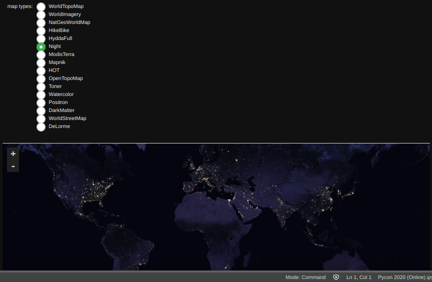
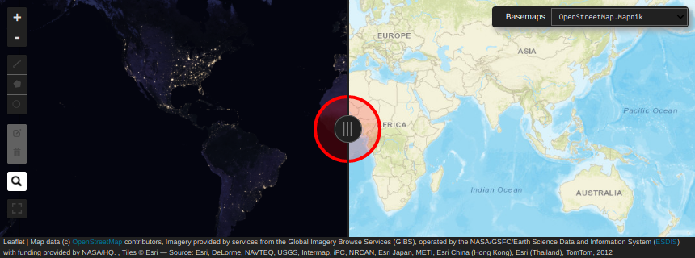

## A Deep Dive into Interactive Geospatial Visualization in Python using IpyLeaflet 
### Pycon Africa, 2020 (Online)
By `Olawale V. Abimbola`  abimbolaolawale41@gmail.com
##### Tutorial notebook is available at `https://github.com/olawale0254/Pycon-Africa-2020-Online-`

## 1. Introduction 

Geospatial analysis and visualisation has become a very great part of Data Science as it is a great approach to storytelling. IpyLeaflet is a Python library which could be use to create interactive and unique visualisation of geospatial data. This talk will be based on creating Interactive maps using IpyLeaflet and also implementing unique Widget
to our maps.

Geospatial Information System (GIS) is a conceptualized framework that provides the ability to capture, store, manipulate, analyze, manage, and present all types of geographical data spatial and Geographic data. Python as a programming language has a lot of libraries which are used for different types of geospatial analysis and each of it has different strengths and limitations. In this talk we will be looking at building interesting and interactive geospatial visualisations using IpyLeaflet, how we could use Ipyleaflet widget to design our maps, creating single and multiple markers on map and exporting the interactive visualization in html.

